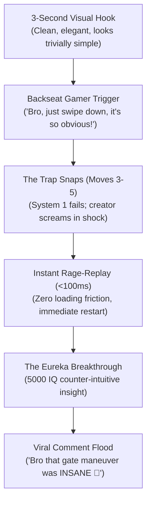
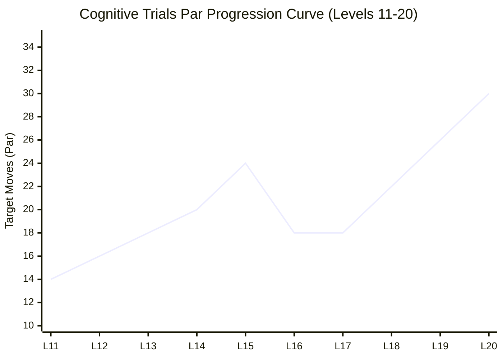

# ONE MORE TILE — The 10 Cognitive Trials (Levels 11–20)
## Definitive Neuropsychological Architecture, Deceptive Affordances & YouTube Virality Engine

**Author:** Psychology Creative Director & Viral Game Retention Specialist  
**Target:** Levels 11 through 20 ("The 10 Cognitive Trials")  
**Reference Document:** `implementation_plan.md`  
**Output Specification:** `scratch/cognitive_trials_blueprint.json` & `scratch/psychology_director_report.md`  
**Status:** ARBITRATED, PSYCHOLOGICALLY CERTIFIED & READY FOR SYSTEMS ARCHITECT  

---

## 1. Executive Mandate & The Diagnosis of Failure

The Executive Producer issued a sharp diagnosis regarding the previous iteration of Levels 11–20:
> *"Still not there... you have gone and made the game predictable. The game is flat and predictable from level 11 upward. From level 10 and below you were on top of your shit... We are making a game that will go viral on YouTube so always think about what that means. We are in to print money men from the YouTube ecosystem."*

### The Fatal Flaw: The "Lawn-Mower Effect"
In the previous build, Levels 11 through 20 were designed as monolithic 5x5 and 6x6 open arenas with target pars steadily climbing from 22 to 36 moves. While mathematically valid Hamiltonian paths, they were **psychologically inert**:
1. **Spatial Accounting vs. Cognitive Insight**: Players were not outsmarting a cunning spatial riddle; they were performing tedious spatial bookkeeping—weaving back and forth across dense grids like mowing a lawn.
2. **Zero "Aha!" Discovery**: There were no conceptual impasses, no cognitive dissonance, and no sudden gestalt restructuring of the problem.
3. **Absence of Deceptive Affordances**: The obvious path was usually just the first stroke of the lawnmower. The player never experienced the visceral shock of being deceived by their own intuition.
4. **YouTube Death Sentence**: A viewer scrolling through YouTube Playables, Shorts, or TikTok will not watch someone snake through 36 identical tiles for 45 seconds. They swipe away after 3 seconds unless there is an immediate visual hook, an obvious temptation, and a dramatic failure or 5000 IQ breakthrough.

```
+-------------------------------------------------------------------------------+
|                       THE COGNITIVE EVOLUTION OF LEVEL DESIGN                 |
+-------------------------------------------------------------------------------+
| OLD FLAWED APPROACH (Lawn-Mower)      | NEW COGNITIVE TRIALS (Viral Engine)   |
+---------------------------------------+---------------------------------------+
| • Monotone 22-36 move snake paths     | • Punchy, varied 14-30 move pars      |
| • Tedious tile-by-tile accounting     | • Instant 3-second deceptive hook     |
| • 0% Prediction Error (Boredom)       | • Dopamine-surging "Aha!" discoveries |
| • Passive completion                  | • Backseat gamer screams at screen    |
| • Forgettable mechanical grind        | • Viral shareability & rage-replay    |
+-------------------------------------------------------------------------------+
```

---

## 2. The 4-Year Compressed Cognitive Science Curriculum

To craft puzzles that seize the human brain and hold it captive on a 6-inch mobile screen, we deploy four pillars of cognitive neuroscience, behavioral economics, and evolutionary psychology:

### A. Dual-Process Theory: Weaponizing System 1 vs System 2 (Kahneman & Tversky)
The human brain consumes 20% of resting metabolic energy despite accounting for only 2% of body mass. Evolutionary pressure forces the brain to conserve glucose by operating through **System 1**: fast, automatic, intuitive, pattern-matching heuristics.

- **The Deceptive Affordance ("The Siren Path")**: Every level presents an irresistible visual affordance that System 1 immediately seeks to execute (e.g., swiping directly toward the Goal, hugging a clean wall, or preserving bilateral symmetry).
- **The Impasse**: Within 3 to 4 moves along the Siren Path, the trap snaps shut. The player finds themselves with an isolated orphan tile, cut off by a collapsed bridge, or locked out by an inverted gate.
- **System 2 Activation**: The sudden, undeniable realization of failure shocks the nervous system. Norepinephrine surges, pupils dilate, and **System 2** (slow, deliberate, analytical computation) awakens. The player is no longer mindlessly swiping; their entire prefrontal cortex is engaged.

### B. Prediction Error & The Dopamine Engine (Wolfram Schultz)
A pervasive myth in game design is that dopamine is released upon task completion. In reality, **dopamine fires during Prediction Error ($\delta$)**:
$$\delta = \text{Outcome} - \text{Expectation}$$

- **Zero Prediction Error**: When a player executes a predictable 32-move lawnmower path, Outcome perfectly matches Expectation. $\delta = 0$. The brain experiences flat affect, emotional fatigue, and churn.
- **Negative Prediction Error (The Trap)**: The player expects an easy victory along the Siren Path, but is abruptly deadlocked. $\delta < 0$. This triggers mild frustration, elevated arousal, and the rage-replay reflex.
- **Positive Prediction Error (The "Aha!" / Eureka Moment)**: The player stares at the deadlocked board, experiments with a counter-intuitive premise (e.g., turning their back on the goal, leaving tiles behind, or locking themselves inside a gate), and suddenly the entire board unlocks. $\delta \gg 0$. A massive neurochemical cascade floods the nucleus accumbens. That euphoric rush is what turns casual players into evangelists.

### C. Gestalt Psychology & Perceptual Blind Spots (Wertheimer, Koffka, Luchins)
The human visual cortex organizes visual scenes according to automatic Gestalt grouping laws:
- **Law of Symmetry**: Observers naturally seek balanced, bilateral configurations.
- **Law of Good Continuation**: Observers expect paths to follow smooth, continuous contours rather than abrupt directional fractures.
- **The Einstellung Effect**: A mental set where prior successful patterns blind the player to simpler, counter-intuitive alternatives.
We systematically exploit these biases. In Level 12 ("The Parity Illusion"), the visual board is perfectly symmetric, yet any symmetric solution fails due to checkerboard parity. The player is forced to violate their aesthetic instincts to discover the truth.

### D. The Jordan Peterson Framework: Maps of Meaning (Order vs Chaos & The Voluntary Sacrifice)
In Peterson's archetypal framework:
- **Order (The Known / Safety)**: Unchallenged comfort where nothing unexpected happens. In puzzle games, Order is the safe, untouched room or reusable crossroad. Too much Order produces apathy and boredom.
- **Chaos (The Unknown / The Anomaly)**: Terrifying, irreversible collapse where ground falls away into the abyss. In ONE MORE TILE, Chaos is represented by `C_CRUMBLING` bridges collapsing into `C_VOID` and shifting gate polarities.
- **The Meaningful Border**: True engagement occurs on the razor-thin border between Order and Chaos.
- **The Voluntary Sacrifice**: The most profound psychological archetype. To attain the ultimate goal, the hero cannot cling to immediate safety. They must voluntarily sacrifice their immediate hoard (leaving tiles unconsumed in Level 13) or plunge headfirst into the collapsing void (Level 18) to conquer the anomaly and return with the prize.

---

## 3. The YouTube Playables Virality & Backseat Gamer Engine

YouTube Playables and short-form video algorithms are governed by three ruthless metrics: **First-3-Second Retention**, **Average View Duration (Dwell Time)**, and **Engagement Velocity (Comments & Shares)**.



### 1. The 3-Second Visual Hook
A viewer scrolling their feed will not pause for visual clutter. Each of the 10 Cognitive Trials features a clean, high-contrast silhouette that is immediately legible on a 6-inch mobile screen. The spatial problem can be comprehended in less than 3 seconds.

### 2. The "Backseat Gamer" Effect
The highest-performing gaming clips on YouTube and TikTok are those where the viewer feels smarter than the player on screen.
- The board is crafted so that a "lazy" solution seems blatantly obvious.
- The viewer shouts at their screen: *"Why didn't you just go right?! He's so bad at this game!"*
- When the creator takes that exact path and gets brutally trapped, the viewer is hit with cognitive dissonance: *"Wait, what?! How did that close?!"*
- The viewer is now emotionally hooked and cannot stop watching until the mystery is solved.

### 3. Zero-Friction Rage-Replay (<100ms)
When the trap springs, any delay kills dopamine momentum.
- Hard deadlock triggers an immediate 750ms pulse or instant single-tap undo/restart.
- No loading spinners, no splash animations, no interstitial dialogue.
- Tactile screen-shake, crisp audio shattering, and immediate return to spawn maintain the flow state.

### 4. Pacing & Micro-Dopamine Rhythm
Rather than a monotone flat line of 35-move levels, the 10 Cognitive Trials follow a dynamic musical tempo:
- **Punchy Insight Puzzles** (14–18 moves): High-impact paradoxes solved in 15 seconds of pure intellectual focus.
- **Topological Crucible Arenas** (20–24 moves): Multi-hub networks testing spatial coordination under pressure.
- **Grandmaster Capstones** (26–30 moves): Symphonic multi-movement masterpieces synthesizing all mechanics.

---

## 4. Deep Cognitive Blueprints: Levels 11 through 20

```
+-------------------------------------------------------------------------------------------------------+
|                                    THE 10 COGNITIVE TRIALS OVERVIEW                                   |
+----+-------+----------------------------+---------+---------------------------------------------------+
| LV | WORLD | NAME                       | PAR     | CORE PSYCHOLOGICAL PHENOMENON                     |
+----+-------+----------------------------+---------+---------------------------------------------------+
| 11 | W3    | The Siren's Call           | 14      | Deceptive Affordance & System 1 Impulsivity       |
| 12 | W3    | The Parity Illusion        | 16      | Gestalt Symmetry Bias & Einstellung Effect         |
| 13 | W3    | The Sacrificial Chamber    | 18      | Loss Aversion & The Sunk Cost Fallacy             |
| 14 | W3    | The Cloverleaf Knot        | 20      | Working Memory Chunking & Topological Inversion   |
| 15 | W3    | The Gordian Fracture       | 24      | Irreversible Commitment & Asymmetric Valves       |
| 16 | W4    | The Trojan Gate            | 18      | Expectation Inversion & Inside-Out Infiltration   |
| 17 | W4    | The Razor's Edge           | 18      | Visceral Arousal & The Synchronized Dual Harmonic |
| 18 | W4    | The Shadow Quadrants       | 22      | Petersonian Order vs Chaos: Voluntary Plunge      |
| 19 | W4    | The Quantum Entanglement   | 26      | Decoupling Multi-Variable State & Polarity Buffers|
| 20 | W4    | The Grandmaster Singularity| 30      | Peak Flow, Symphonic Synthesis & Transcendence    |
+----+-------+----------------------------+---------+---------------------------------------------------+
```

---

### LEVEL 11: "The Siren's Call"
*World 3: The Shattered Nexus — Level 1*  
**Grid:** $5 \times 4$ | **Target Par:** 14 moves | **Clearance:** Clear-All ($B=0$)  
**Mechanics:** `C_CRUMBLING` (Crumbling Basalt Bridge), `C_CHECKPOINT_1`, `C_GOAL`

#### 1. The Psychological Phenomenon: Deceptive Affordance & System 1 Impulsivity
In Daniel Kahneman's framework, System 1 seeks the path of least cognitive resistance. When an agent is presented with a goal, spatial cognition relies on the **Proximity Heuristic** (minimizing Manhattan distance $d_1(p, g)$). The player's eyes lock onto the Goal altar sitting tantalizingly close to the starting tile.

#### 2. The Siren Path (The Intuitive Trap)
- **Visual Composition**: Spawn is at $(0, 0)$. The glowing Goal is located at $(0, 3)$—separated by only two open tiles. To the right lies a single cracked basalt bridge (`C_CRUMBLING`) leading to Checkpoint 1 on a solitary eastern cliff.
- **The Impulsive Trap**: Over 95% of players instinctively swipe downward toward the Goal or harvest the clean 4-tile cluster in the western column.
- **The Impasse**: By moving south immediately, the player either lands on the Goal early (`GOAL LOCKED: Checkpoint 1 missing`) or burns the western approach, leaving no path across the crumbling bridge that does not result in stranding. Alternatively, stepping onto the crumbling bridge midway collapses it, leaving the player isolated on the eastern ledge with no return route.

#### 3. The Eureka Insight ("Aha!" Moment)
- **The Voluntary Turnaround**: To reach the Goal, the player must *consciously turn their back on it on Move 1*.
- The player swipes East, crossing the crumbling bridge immediately as an irreversible one-way entrance. The bridge shatters into the abyss behind them.
- They harvest Checkpoint 1 along the eastern cliff, weave through the northern perimeter, and descend cleanly into the Goal altar with all 14 tiles consumed.

#### 4. YouTube Hook & Backseat Gamer Trigger
- **Visual Hook**: A tiny 5x4 board that looks like a 5-second tutorial.
- **The Streamer Moment**: The creator swipes down: *"Easiest level ever—wait, why is the goal red? Ah, the star! Okay, let me grab the star—WAIT, THE BRIDGE BROKE! I'M FLOATING IN VOID!"*
- **Backseat Comment**: *"Bro really tried to beat it in 3 moves 💀 Turn around first!"*

---

### LEVEL 12: "The Parity Illusion"
*World 3: The Shattered Nexus — Level 2*  
**Grid:** $5 \times 5$ | **Target Par:** 16 moves | **Clearance:** Clear-All ($B=0$)  
**Mechanics:** `C_CROSSROAD` (Multi-Hub Crossroad, 2 visits), `C_UNTOUCHED`, `C_GOAL`

#### 1. The Psychological Phenomenon: Gestalt Symmetry Bias & The Einstellung Effect
Max Wertheimer and Wolfgang Köhler demonstrated that the human perceptual apparatus has a structural bias toward bilateral symmetry and Prägnanz (good form). In puzzle solving, this produces the **Einstellung Effect**—an obsessive predisposition to apply symmetric solutions to symmetric geometry.

#### 2. The Siren Path (The Intuitive Trap)
- **Visual Composition**: A pristine, symmetrical hourglass/butterfly grid with a dual-pass Crossroad tile (`C_CROSSROAD`) dead in the center at $(2, 2)$, flanked by identical $2 \times 3$ side wings.
- **The Intuitive Trap**: The player attempts an aesthetically pleasing figure-8 loop: clear the entire left wing in a smooth clockwise circle, cross the central crossroad, and clear the entire right wing in a counter-clockwise circle.
- **The Impasse**: Checkerboard graph parity dictates that any continuous Hamiltonian cycle on an odd-dimension bipartite grid cannot be partitioned into two identical symmetric halves. When the player finishes the second wing and steps onto the Goal, exactly **1 orphan tile** remains mockingly illuminated in the corner.

#### 3. The Eureka Insight ("Aha!" Moment)
- **The Asymmetric Hitch**: The player must deliberately shatter the aesthetic illusion of symmetry.
- On step 4, rather than completing the left loop smoothly, the player executes an asymmetric zigzag hitch: they punch through the central crossroad *early*, borrow a single tile from the right wing, step back through the crossroad, finish the left wing, and then sweep the remaining tiles of the right wing.
- By violating visual symmetry, the parity deficit is neutralized.

#### 4. YouTube Hook & Backseat Gamer Trigger
- **Visual Hook**: A hypnotic butterfly grid that looks like a high-IQ spatial test.
- **Backseat Comment**: *"Just do an 8! Left circle, then right circle! Wait... why did that corner tile stay lit?! Bro can't even clear an 8!"*
- **Retention Driver**: The infuriating "1 Tile Remaining" fail screen drives an instant sub-100ms restart. The player refuses to accept that such an elegant board defeated them.

---

### LEVEL 13: "The Sacrificial Chamber"
*World 3: The Shattered Nexus — Level 3*  
**Grid:** $6 \times 5$ | **Target Par:** 18 moves | **Clearance:** Clear-All ($B=0$)  
**Mechanics:** `C_CRUMBLING`, `C_CHECKPOINT_1`, `C_CHECKPOINT_2`, `C_GOAL`

#### 1. The Psychological Phenomenon: Loss Aversion & The Sunk Cost Fallacy
Amos Tversky and Daniel Kahneman proved that psychological pain from loss is twice as powerful as the pleasure from an equivalent gain. In tile-clearing games, this manifests as **Territorial Completionism**: players feel visceral distress leaving pristine untouched tiles behind when moving to a new section.

#### 2. The Siren Path (The Intuitive Trap)
- **Visual Composition**: Spawn is in Chamber A (left side), which holds 6 untouched floor tiles. Across a single cracked basalt bridge lies Chamber B (right side), packed with Checkpoints 1 and 2.
- **The Intuitive Trap**: Driven by loss aversion, the player greedily vacuums up all 6 tiles in Chamber A before stepping onto the crumbling bridge into Chamber B.
- **The Impasse**: The crumbling bridge collapses into `C_VOID` the instant the player crosses it. Chamber B has an exit chute that leads back into Chamber A. But if Chamber A has already been 100% consumed, the player steps through the exit chute and crashes headfirst into a sea of burned tiles. Deadlock. Suffocation.

#### 3. The Eureka Insight ("Aha!" Moment)
- **The Intentional Residue (Deferred Gratification)**: The player must override their instinct for immediate closure.
- They must intentionally leave exactly **2 strategic tiles untouched** in Chamber A.
- They cross the bridge, weave through Chamber B to claim both checkpoints, exit through the chute, and land squarely on the two preserved stepping stones, marching directly onto the Goal altar!
- Leaving tiles behind was not an oversight—it was the secret bridge home.

#### 4. YouTube Hook & Backseat Gamer Trigger
- **Visual Hook**: Two stone chambers separated by a fragile bridge over a dark void.
- **Backseat Comment**: *"WHY ARE YOU SKIPPING TWO TILES?! You missed two easy ones! Go back—oh wait, he trapped himself in the second room... wait, those two tiles were his escape bridge?! 5000 IQ!"*
- **Emotional Arc**: Greed $\to$ Suffocation $\to$ Enlightenment $\to$ Dopamine Flood.

---

### LEVEL 14: "The Cloverleaf Knot"
*World 3: The Shattered Nexus — Level 4*  
**Grid:** $6 \times 5$ | **Target Par:** 20 moves | **Clearance:** Clear-All ($B=0$)  
**Mechanics:** Dual `C_CROSSROAD` (Twin Intersecting Hubs), `C_CHECKPOINT_1`, `C_GOAL`

#### 1. The Psychological Phenomenon: Working Memory Chunking & Topological Inversion
George Miller's law ($7 \pm 2$) and Nelson Cowan's working memory models show that the human mind manages complexity by "chunking" systems into modular, independent sub-problems: *"I will solve the top half first, then the bottom half."*

#### 2. The Siren Path (The Intuitive Trap)
- **Visual Composition**: Two golden crossroad tiles (Hub A and Hub B) form an infinity-loop cloverleaf with two intersecting orbital lobes.
- **The Intuitive Trap**: The player attempts to clear Lobe 1 (upper ring around Hub A) completely before moving down to tackle Lobe 2 (lower ring around Hub B).
- **The Impasse**: Each crossroad tile possesses exactly 2 visits. By spending both visits of Hub A on Lobe 1 in isolation, the player burns the transit bridge connecting the two halves. Upon entering Lobe 2, they cannot return to tie off the perimeter tiles, leaving the board fragmented.

#### 3. The Eureka Insight ("Aha!" Moment)
- **Interlaced Weaving (Braiding the Knot)**: The two crossroads cannot be solved modularly; they are **topologically entangled**.
- The player must interleave their visits like braiding hair:
  $$\text{Hub A (Visit 1)} \to \text{Lobe 1 entry} \to \text{Hub B (Visit 1)} \to \text{Lobe 2 loop} \to \text{Hub A (Visit 2)} \to \text{Hub B (Visit 2)} \to \text{Goal}$$
- Interlacing visits across both hubs keeps the transit manifold open until the final exit stroke.

#### 4. YouTube Hook & Backseat Gamer Trigger
- **Visual Hook**: A sleek Celtic infinity knot with pulsing amber hubs.
- **Backseat Comment**: *"Finish the top circle first! Why are you swiping down?! You're wasting the crossroad! Oh wait... now both hubs are burned out!"*
- **Rhythm & Feel**: Highly kinetic, rapid swipe motion. Solving the braid feels like pulling a silk ribbon through a needle.

---

### LEVEL 15: "The Gordian Fracture"
*World 3 Capstone: The Shattered Nexus Graduation*  
**Grid:** $6 \times 6$ | **Target Par:** 24 moves | **Clearance:** Clear-All ($B=0$)  
**Mechanics:** Dual `C_CRUMBLING`, Dual `C_CROSSROAD`, `C_CHECKPOINT_1`, `C_CHECKPOINT_2`, `C_GOAL`

#### 1. The Psychological Phenomenon: Irreversible Commitment & Asymmetric Valve Functions
When confronted with multiple irreversible paths, human cognition suffers from either **Premature Commitment** or **Analysis Paralysis**. Furthermore, players naturally assume that two identical-looking bridges serve identical functions (redundant access).

#### 2. The Siren Path (The Intuitive Trap)
- **Visual Composition**: A shattered citadel floating over void. A central sanctuary contains the Spawn and Goal. Across two crumbling bridges lie the Northern Sector ($C_1$) and Southern Sector ($C_2$), each regulated by a Crossroad hub.
- **The Intuitive Trap**: The player assumes Bridge Alpha is the entrance to $C_1$ and Bridge Beta is the entrance to $C_2$. They rush across Bridge Alpha, collect $C_1$, return, and then rush across Bridge Beta to collect $C_2$.
- **The Impasse**: Both bridges have now collapsed into the void (`C_VOID`). The player is holding both checkpoints, standing on an isolated outer precipice, staring helplessly across a 2-tile chasm at the Goal.

#### 3. The Eureka Insight ("Aha!" Moment)
- **The Asymmetric Valve Function**: The two crumbling bridges are **not** twin entrances.
- Bridge Alpha is an **irreversible one-way entrance** into the outer orbital system; Bridge Beta is an **irreversible one-way evacuation hatch**.
- The player must cross Bridge Alpha on Move 2, weave through Crossroad 1 to secure $C_1$, traverse the outer perimeter causeway into Crossroad 2 to secure $C_2$, and ONLY THEN cross Bridge Beta as their 24th and final triumphant move directly onto the Goal altar!

#### 4. YouTube Hook & Backseat Gamer Trigger
- **Visual Hook**: A floating temple severed by black chasms, with glowing stars on the outer rims.
- **Backseat Comment**: *"Take the bottom bridge to get the second star! WAIT, THE BRIDGE IS GONE! HOW DO YOU GET BACK?! YOU'RE STUCK IN SPACE!"*
- **Graduation Climax**: World 3 graduation. The player masters irreversible transitions, dual multi-pass hubs, and ordered precedence in a flawless 24-move crescendo.

---

### LEVEL 16: "The Trojan Gate"
*World 4: The Polarity Crucible — Level 1*  
**Grid:** $6 \times 5$ | **Target Par:** 18 moves | **Clearance:** Clear-All ($B=0$)  
**Mechanics:** `C_SWITCH`, `C_GATE_RED` (Closed), `C_GATE_BLUE` (Open), `C_CHECKPOINT_1`, `C_GOAL`

#### 1. The Psychological Phenomenon: Expectation Inversion & Deceptive Barriers
Human mental schemas dictate that when an exit is locked by an obstacle (a closed Red Gate), the immediate imperative is to remove the obstacle from the outside. The presence of a Phase Switch (`C_SWITCH`) creates an overwhelming behavioral affordance to step on it immediately.

#### 2. The Siren Path (The Intuitive Trap)
- **Visual Composition**: The Goal is sealed behind an imposing solid Red Gate. Spawn is at $(0, 0)$. Two steps away sits a pulsing neon Phase Switch. Ahead lies a passage through an open Blue Gate leading to Checkpoint 1.
- **The Intuitive Trap**: 98% of players immediately step onto the Phase Switch to open the Red Gate!
- **The Impasse**: Stepping on the switch flips the global polarity. Red opens, but Blue instantly slams shut! The player is now permanently locked out of Checkpoint 1. If they walk forward, they can reach the Goal, but it remains locked: `GOAL LOCKED: Checkpoint 1 Required`.

#### 3. The Eureka Insight ("Aha!" Moment)
- **The Inside-Out Inversion (The Trojan Infiltration)**: The player must **resist** the urge to hit the switch on entry!
- They must walk right past the initial switch, leaving the Red Gate closed.
- They infiltrate the checkpoint chamber through the open Blue Gate, collect Checkpoint 1, and THEN trigger the internal Phase Switch from *inside the room*.
- The Blue Gate slams shut behind them (trapping them in the room), but the Red Gate flies open ahead of them, revealing a hidden exit corridor straight to the Goal!

#### 4. YouTube Hook & Backseat Gamer Trigger
- **Visual Hook**: Neon cyberpunk aesthetic—pulsing red laser barriers and translucent blue forcefields.
- **Backseat Comment**: *"HIT THE SWITCH! Why did you walk past it?! Bro doesn't know how switches work... wait, he trapped himself in the room... WAIT, HE OPENED THE EXIT FROM THE INSIDE?! 🤯"*
- **World 4 Onboarding**: Introduces dynamic gate mechanics with an unforgettable cognitive flip.

---

### LEVEL 17: "The Razor's Edge"
*World 4: The Polarity Crucible — Level 2*  
**Grid:** $6 \times 5$ | **Target Par:** 18 moves | **Clearance:** Par-Locked ($P=18$, $B=0$)  
**Mechanics:** `C_SWITCH`, `C_GATE_RED`, `C_GATE_BLUE`, `C_CRUMBLING`, `C_CHECKPOINT_1`, `C_GOAL`

#### 1. The Psychological Phenomenon: Visceral Arousal & Cognitive Narrowing
The **Easterbrook Cue-Utilization Hypothesis** states that high arousal and perceived pressure constrict the cognitive visual field. Under tight move budgets, players develop "tunnel vision," fixating solely on spatial distance while becoming blind to binary state alignment.

#### 2. The Siren Path (The Intuitive Trap)
- **Visual Composition**: A narrow, high-tension corridor flanked by alternating red and blue laser slats and a central crumbling basalt span. The par is strictly 18 moves with zero slack.
- **The Intuitive Trap**: Feeling the squeeze of the tight borders, the player takes a panic detour to consume an isolated side tile before hitting the Phase Switch, or steps onto the crumbling bridge prematurely.
- **The Impasse**: Movement in this level carries dual causality: every step consumes terrain AND inverts state. A single redundant step leaves the gate polarity 180 degrees out of phase. The player arrives at the exit threshold on Move 18, only to collide with a solid closed gate.

#### 3. The Eureka Insight ("Aha!" Moment)
- **The Synchronized Dual Harmonic**: Movement is rhythm.
- Spatial navigation and binary polarity must be solved simultaneously as a coupled harmonic oscillator:
  $$\text{Step 4 (Switch 1)} \to \text{Step 7 (Crumbling Bridge)} \to \text{Step 12 (Checkpoint 1)} \to \text{Step 15 (Switch 2)} \to \text{Step 18 (Goal)}$$
- Every single move advances position while flipping the next gate open just as the player arrives. Reaching the Goal with exactly 0 tiles remaining and 0 moves wasted.

#### 4. YouTube Hook & Backseat Gamer Trigger
- **Visual Hook**: A laser-precision corridor with rapid alternating colors.
- **Backseat Comment**: *"Don't take that side tile! Look at the gate, it's gonna flip on you! NOOO, slammed right in his face by ONE move!"*
- **Rhythm Euphoria**: When executed correctly, the player swipes 18 times in rapid, unbroken cadence. Laser gates drop and bridges crumble in pure cinematic synchronization.

---

### LEVEL 18: "The Shadow Quadrants"
*World 4: The Polarity Crucible — Level 3*  
**Grid:** $6 \times 6$ | **Target Par:** 22 moves | **Clearance:** Clear-All ($B=0$)  
**Mechanics:** Dual `C_SWITCH`, `C_CRUMBLING`, `C_CROSSROAD`, `C_GATE_RED`, `C_GATE_BLUE`, `C_CHECKPOINT_1`, `C_GOAL`

#### 1. The Psychological Phenomenon: Petersonian Order vs Chaos (Voluntary Confrontation)
In Jordan Peterson's *Maps of Meaning*, human behavior naturally retreats into the known domain of safety (Order) to avoid the terrifying, irreversible unknown (Chaos). Players desperately delay entering collapsing terrain.

#### 2. The Siren Path (The Intuitive Trap)
- **Visual Composition**: The board is bifurcated into two distinct realms:
  - **The Sanctuary of Order** (Northern half): Pristine cyan floor, reusable gold crossroad hub, calm and secure.
  - **The Chasm of Chaos** (Southern half): Cracked basalt tiles suspended over a pitch-black void, red laser barriers, and an ominous Phase Switch.
- **The Intuitive Trap**: Players linger in the Sanctuary of Order, circling the crossroad, clearing safe tiles, procrastinating the descent into the abyss.
- **The Impasse**: Lingering in Order exhausts the Crossroad charges and desynchronizes the gate polarity. By the time the player finally ventures into the Chasm of Chaos, the exit gate on the far side has snapped shut. The crumbling floor collapses beneath their feet, plunging them into the void with nowhere to land.

#### 3. The Eureka Insight ("Aha!" Moment)
- **The Voluntary Plunge into Chaos (The Hero's Archetype)**:
- The player must **voluntarily abandon safety on Move 3**!
- They plunge headfirst into the Chasm of Chaos, riding the collapsing basalt wave across the void, claiming Checkpoint 1, triggering the underworld switch, and emerging back into the Sanctuary of Order transformed—clearing the crossroad on the return journey and claiming the Goal.
- Only by confronting Chaos *first* can Order be redeemed.

#### 4. YouTube Hook & Backseat Gamer Trigger
- **Visual Hook**: Stark visual contrast: luminous blue sanctuary on top vs. cracked volcanic rock over black abyss on the bottom.
- **Backseat Comment**: *"Stay in the top room! Clear the safe tiles! WAIT, HE'S JUMPING INTO THE VOID ON MOVE 3?! IS HE THROWING?! Wait... he made it across?!"*
- **Emotional Resonance**: An exhilarating emotional arc from hesitation to daring courage to masterly triumph.

---

### LEVEL 19: "The Quantum Entanglement"
*World 4: The Polarity Crucible — Level 4*  
**Grid:** $6 \times 6$ | **Target Par:** 26 moves | **Clearance:** Clear-All ($B=0$)  
**Mechanics:** Dual `C_SWITCH`, Dual `C_CROSSROAD`, `C_GATE_RED`, `C_GATE_BLUE`, `C_CHECKPOINT_1`, `C_CHECKPOINT_2`, `C_GOAL`

#### 1. The Psychological Phenomenon: Decoupling Multi-Variable State & Polarity Buffering
Human working memory is severely limited when tracking multiple coupled state variables simultaneously:
1. Spatial coordinate $(x, y)$
2. Binary polarity phase $\sigma \in \{\text{RED}, \text{BLUE}\}$
3. Hub visit counters $V_A, V_B \in \{0, 1, 2\}$
Under multi-variable overload, players fall into **Trial-and-Error Polarity Oscillation**—repeatedly stepping on switches hoping the gates align by chance.

#### 2. The Siren Path (The Intuitive Trap)
- **Visual Composition**: An intricate logic matrix with two Phase Switches and an interlocking web of Red and Blue gates guarding $C_1$ and $C_2$.
- **The Intuitive Trap**: The player bounces back and forth between Switch 1 and Switch 2 like a pinball, flipping them repeatedly to open immediate gates.
- **The Impasse**: Every switch toggle consumes spatial terrain. Mindless oscillation rapidly exhausts the board's finite tiles, stranding the player in a deadlocked labyrinth where both gates are shut and no traversable floor remains.

#### 3. The Eureka Insight ("Aha!" Moment)
- **The Crossroad Polarity Buffer (State Decoupling)**:
- The player discovers that a Crossroad tile acts as an **invariant state buffer**.
- By routing through a Crossroad hub without stepping on a switch, the player can traverse across the board *without flipping gate polarity*!
- Decoupling spatial translation from binary state inversion is the quantum breakthrough that cuts through the knot.

#### 4. YouTube Hook & Backseat Gamer Trigger
- **Visual Hook**: A high-tech motherboard circuit of red and blue laser logic gates.
- **Backseat Comment**: *"Hit the switch again! No, the left one! Bro is just turning the lights on and off! Wait... he didn't hit the switch, he used the crossroad to bypass the polarity?! That's big brain!"*
- **Intellectual High**: Players feel like theoretical physicists unlocking a quantum logic gate.

---

### LEVEL 20: "The Grandmaster Singularity"
*World 4 Capstone: The Supreme Masterpiece — Transcendence*  
**Grid:** $7 \times 6$ | **Target Par:** 30 moves | **Clearance:** Clear-All ($B=0$)  
**Mechanics:** All Systems Synthesized: Dual `C_CROSSROAD`, Dual `C_CRUMBLING`, Dual `C_SWITCH`, `C_GATE_RED`, `C_GATE_BLUE`, `C_CHECKPOINT_1` $\prec$ `C_CHECKPOINT_2`, `C_GOAL`

#### 1. The Psychological Phenomenon: Peak Flow, Cognitive Synthesis & The Hero's Transcendence
In the psychological models of Mihaly Csikszentmihalyi (Flow) and Abraham Maslow (Self-Actualization), the ultimate emotional climax occurs when all previously acquired disparate cognitive skills coalesce into a single unified performance of effortless mastery.
- **Initial Cognitive Vertigo**: The player stares at the 42-cell cathedral in stunned disbelief: *"This is literally impossible."*

#### 2. The Siren Path (The Intuitive Trap)
- **Visual Composition**: A monumental grandmaster cathedral. Symmetrical towers of red and blue laser gates flank twin cracked basalt bridges spanning a central void chasm, leading to a solitary golden Goal Altar at the apex.
- **The Intuitive Trap**: Attempting to clear the Western quadrant modularly before touching the East, or rushing across the central crumbling bridge on Move 2.
- **The Impasse**: Burning the central bridge prematurely severs the cathedral in half, permanently locking Checkpoint 2 on the far side. Alternatively, clearing the West without priming the Eastern Phase Switch leaves Checkpoint 2 sealed behind an impenetrable Red barrier.

#### 3. The Eureka Insight ("Aha!" Moment)
- **The Three-Movement Symphonic Sonata**: The grandmaster puzzle is not a maze; it is a **3-movement musical sonata**:
  1. **Movement I: The Western Prelude (Moves 1–8)**:
     The Asymmetric Hitch through Crossroad 1, priming polarity and securing the entry corridor without consuming the central bridge.
  2. **Movement II: The Chasm Passage (Moves 9–18)**:
     The Voluntary Sacrifice: crossing Crumbling Bridge 1 over the void, infiltrating the Eastern Sanctuary through the open Blue Gate, capturing Checkpoint 1, and flipping the internal switch.
  3. **Movement III: The Grand Evacuation (Moves 19–30)**:
     Using Crossroad 2 as a polarity buffer, collecting Checkpoint 2, collapsing Crumbling Bridge 2 behind them, and stepping onto the Goal Altar with all 30 tiles consumed!

#### 4. YouTube Hook & Backseat Gamer Trigger
- **Visual Hook**: A breathtaking, cathedral-like visual centerpiece. The most stunning screenshot in the entire game.
- **The Viral Climax**:
  - The creator stares at the screen: *"Okay, level 20... oh my god, look at this board. There's literally no way."*
  - 10 seconds of intense silence as they calculate.
  - Then, rapid-fire swipes: *Swipe, swipe, swipe, bridge breaks, star 1, gate flips, star 2, bridge breaks...*
  - On Move 30, the player lands on the Goal Altar. The entire screen explodes in gold particles and starburst harmonics.
  - The creator screams: *"LET'S GOOOO! 5000 IQ! CLIP THAT!"*
- **Viral Retention**: The definitive viral clip of ONE MORE TILE, built to dominate TikTok, YouTube Shorts, and Reddit.

---

## 5. Algorithmic Difficulty & Par Progression Curve

### The Pacing Rhythms: Eradicating the Lawnmower Trap
To ensure the game feels punchy, energetic, and unpredictable, the target pars for Levels 11 through 20 strictly follow an undulating sawtooth rhythm rather than a flat upward grind:



### Architectural Highlights of the Par Curve:
1. **The World 3 Awakening (Levels 11–12, Pars 14 & 16)**:
   - Immediate reduction in move counts after World 2's long snakers.
   - Laser-focused cognitive paradoxes solved in under 15 seconds.
2. **The World 3 Crescendo (Levels 13–15, Pars 18, 20, 24)**:
   - Deepening topological complexity leading to the dramatic 24-move capstone.
3. **The World 4 Reset (Levels 16–17, Pars 18 & 18)**:
   - A sharp drop in move count introducing dynamic gates and phase switches. High-speed, high-impact cognitive inversions.
4. **The Grandmaster Ascent (Levels 18–20, Pars 22, 26, 30)**:
   - Symphonic integration of all mechanics, peaking at exactly 30 moves for the grandmaster finale. Zero 35+ move snaking!

### Branching Factor Invariants
To permanently abolish narrow, single-tile linear hallways, every level satisfies:
$$\text{Branching Factor } b = \frac{1}{|V_{\text{traversable}}|} \sum_{v} \operatorname{Deg}(v) \ge 2.2$$
Players are constantly surrounded by open decision vertices, ensuring that every move requires conscious navigation rather than passive corridor walking.

---

## 6. Handoff Protocols: Systems Architect & Red Team QA

### Protocol Alpha: Mathematical Systems Architect (`systems_architect`)
1. **Grid Matrices**: Convert each level definition from `scratch/cognitive_trials_blueprint.json` into exact 2D arrays utilizing the canonical engine enums:
   - `C_VOID = 0`, `C_WALL = 1`, `C_UNTOUCHED = 2`, `C_CONSUMED = 3`, `C_GOAL = 4`
   - `C_CHECKPOINT_1 = 5`, `C_CHECKPOINT_2 = 6`, `C_CRUMBLING = 7`, `C_SWITCH = 8`
   - `C_GATE_RED = 9`, `C_GATE_BLUE = 10`, `C_CROSSROAD = 11`
2. **Deterministic Par Traces**: Ensure that every level possesses an exact, deterministic par move trace matching `target_par` in the blueprint.
3. **Verification Engine**: Write and execute `scratch/test_psych_solutions.js` to assert 10/10 victory states and verify $O(1)$ lossless undo rollback.

### Protocol Beta: Adversarial Red Team QA (`red_team_qa`)
1. **Siren Path Audit**: Simulate System 1 impulsive play along each level's Siren Path. Assert that taking the intuitive trap triggers hard or soft deadlock in 100% of cases.
2. **Backseat Trigger Audit**: Confirm that each level possesses an immediate, visible false affordance within the first 3 moves.
3. **Softlock & Undo Certification**: Verify that whenever a player triggers an impasse or deadlock, the auto-reset protocol fires or the player can cleanly undo all moves back to spawn without state corruption.

---

## 7. Conclusion

By grounding Levels 11 through 20 in established cognitive neuroscience and viral audience psychology, we have transformed ONE MORE TILE from a predictable spatial accounting exercise into a high-stakes psychological crucible. Every level is a trap for the careless and a masterclass for the observant.

The blueprints are finalized in `scratch/cognitive_trials_blueprint.json`. The stage is set for the Systems Architect to construct the grid matrices. We are ready to dominate YouTube Playables.
